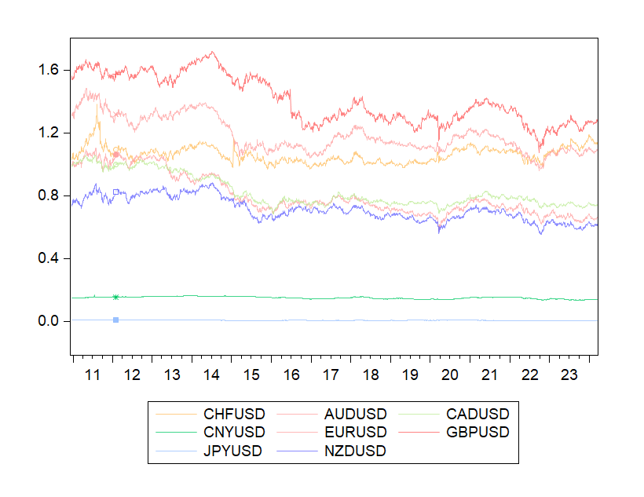
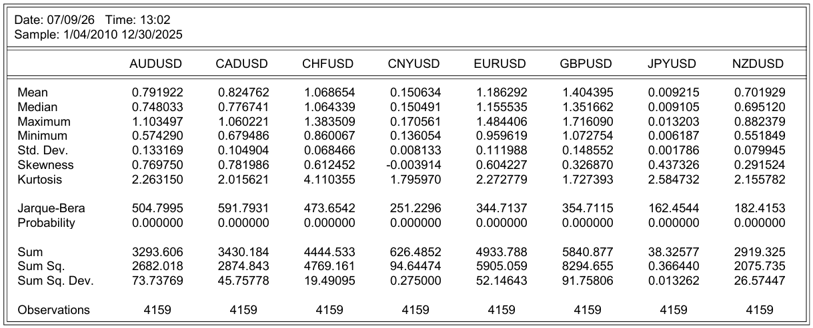
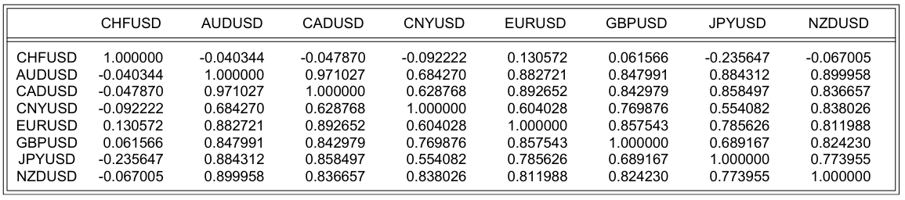
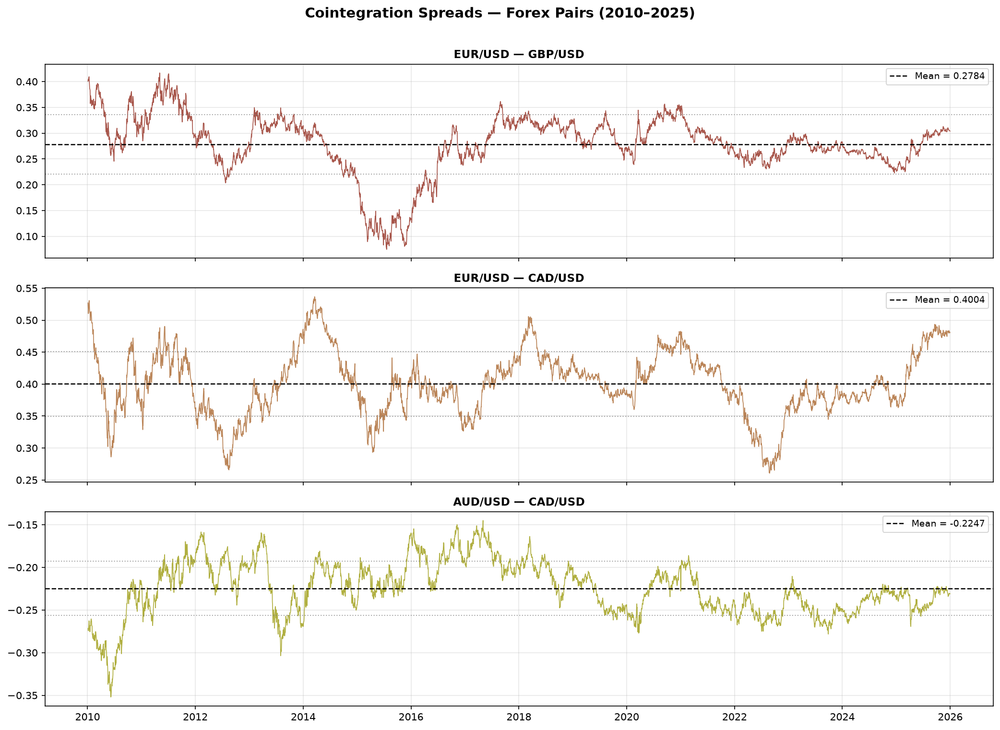

# Cointegration in FX Markets: An Econometric Study (2010–2025)

## Overview

Do major currency pairs share long-run equilibrium relationships?
This project investigates cointegration among eight major exchange
rates against the US dollar using classical econometric techniques.
The analysis combines exploratory data analysis, stationarity
testing, two cointegration methodologies (Engle-Granger and
Johansen), and spread analysis for the cointegrated pairs.

The motivation is both academic and practical: cointegration is
the statistical foundation of pairs trading strategies. Identifying
currency pairs that share a long-run equilibrium allows the
construction of mean-reverting spreads that can be exploited
systematically.

An important distinction throughout this study is that correlation 
measures short-term co-movement, whereas cointegration captures 
long-run equilibrium relationships.

---

## Methodology
1. Download daily prices

2. Standardise quotations

3. Perform exploratory analysis

4. Test stationarity (ADF)

5. Estimate Engle-Granger models

6. Estimate Johansen tests

7. Construct spreads

8. Interpret mean reversion

---
## Data

- **Source:** Yahoo Finance (yfinance) - daily closing prices
- **Period:** January 2010 - December 2025
- **Observations:** 4,159 trading days
- **Software:** Python (data collection), EViews (econometric analysis)

Note: All exchange rates were standardised as currency/USD. Pairs
originally quoted as USD/currency (CHF, JPY, CNY, CAD) were
inverted (1/price) to ensure consistency across all series.
The Chinese yuan (CNY) is included as a representative Asian
currency, though its controlled float regime introduces a structural
threat discussed in the results.

| Series | Currency | Standardisation |
|---|---|---|
| EURUSD | Euro | Direct |
| GBPUSD | British Pound | Direct |
| AUDUSD | Australian Dollar | Direct |
| NZDUSD | New Zealand Dollar | Direct |
| CHFUSD | Swiss Franc | Inverted (1/USDCHF) |
| JPYUSD | Japanese Yen | Inverted (1/USDJPY) |
| CNYUSD | Chinese Yuan | Inverted (1/USDCNY) |
| CADUSD | Canadian Dollar | Inverted (1/USDCAD) |

---

## Exploratory Analysis

### Price Evolution (2010–2025)

The chart reveals several key structural features of the sample
period. GBP shows a sharp depreciation in 2015–2016 driven by
Brexit uncertainty. CHF experienced an abrupt appreciation in
January 2015 when the Swiss National Bank unexpectedly removed
the EUR/CHF floor. CNY and JPY appear almost flat due to their
small absolute values against the USD.

### Descriptive Statistics

The Jarque-Bera test rejects normality for all series (p=0.000),
consistent with the fat-tailed distributions typical of financial
time series. CNYUSD shows near-zero skewness (-0.004), reflecting
the smoothing effect of central bank intervention.

### Correlation Matrix

AUDUSD and CADUSD show the highest correlation (0.971), both
being commodity currencies sensitive to raw material prices.
CHFUSD shows low or negative correlations with most pairs
(-0.235 with JPYUSD), consistent with its safe-haven role which
drives it by different logic than other currencies.

---

## Stationarity Testing

All series were tested for unit roots using the Augmented
Dickey-Fuller (ADF) test. The null hypothesis is the presence
of a unit root (non-stationarity).

| Series | ADF Level (p-value) | ADF 1st Diff (p-value) | Order |
|---|---|---|---|
| EURUSD | 0.1008 | 0.0001 | I(1) |
| GBPUSD | 0.3203 | 0.0001 | I(1) |
| AUDUSD | 0.6341 | 0.0001 | I(1) |
| NZDUSD | 0.4375 | 0.0001 | I(1) |
| CHFUSD | 0.0731 | 0.0001 | I(1) |
| CADUSD | 0.5824 | 0.0001 | I(1) |
| JPYUSD | 0.8790 | 0.0001 | I(1) |
| CNYUSD | 0.6818 | 0.0001 | I(1) |

All series are integrated of order one - I(1). This is the
necessary condition for cointegration analysis. CHFUSD is the
closest to the 5% threshold (0.0731) in levels but clearly
stationary in first differences.

---

## Cointegration Tests

Seven currency pairs were tested for cointegration using two
complementary methods: the Engle-Granger two-step procedure
and the Johansen system test.

**Engle-Granger:** estimates an OLS regression between the two
series and tests whether the residuals are stationary. If the
residuals are I(0), the pair is cointegrated.

**Johansen:** a system-based approach that can detect multiple
cointegrating relationships simultaneously. Two test statistics
are reported: the Trace test (more powerful) and the
Max-eigenvalue test (more conservative).

| Pair | Engle-Granger | Johansen Trace | Johansen Max-Eigen | Conclusion |
|---|---|---|---|---|
| EURUSD - GBPUSD | 0.0165 | 0.0356 | 0.1528 | Probable cointegration |
| AUDUSD - NZDUSD | 0.1582 | 0.1742 | 0.3194 | No cointegration |
| EURUSD - CHFUSD | 0.1008 | 0.0810 | 0.4002 | No cointegration |
| EURUSD - CADUSD | 0.0020 | 0.0437 | 0.0647 | Probable cointegration |
| AUDUSD - CADUSD | 0.0014 | 0.0393 | 0.2009 | Probable cointegration |
| GBPUSD - CHFUSD | 0.3390 | 0.1499 | 0.0619 | No cointegration |
| JPYUSD - CNYUSD | 0.5955 | 0.0496 | 0.0945 | No cointegration |

A consistent pattern emerges: the Johansen Max-eigenvalue test
is the most conservative and never confirms cointegration alone.
The three pairs where both Engle-Granger and Johansen Trace agree
are considered the most robust findings.

---

## Spread Analysis

For the three pairs with evidence of cointegration, the hedge
ratio was estimated via OLS and the spread constructed as:

**spread = series₁ − β · series₂**

Where β is the OLS coefficient (hedge ratio).

| Pair | Hedge Ratio (β) | Mean Spread | Std. Dev. | Trading Quality |
|---|---|---|---|---|
| EURUSD - GBPUSD | 0.6465 | 0.2784 | 0.0576 | Medium - Brexit disruption |
| EURUSD - CADUSD | 0.9529 | 0.4004 | 0.0505 | High - stable oscillation |
| AUDUSD - CADUSD | 1.2327 | -0.2247 | 0.0318 | Low - downward drift |

**EURUSD - GBPUSD:** the spread shows a severe dislocation in
2014–2016 driven by Brexit uncertainty, falling well below the
long-run mean before recovering. The relationship exists but is
subject to structural breaks from political events.

**EURUSD - CADUSD:** the cleanest spread out of the three, oscillating
around its mean without clear trend. This is the strongest
candidate for a pairs trading strategy among the pairs analysed.

**AUDUSD - CADUSD:** despite statistical evidence of cointegration
from Engle-Granger and Johansen Trace, the spread shows a
persistent downward drift, inconsistent with true mean reversion.
This explains the conflicting Max-eigenvalue result and suggests
the cointegration evidence is weak in practice.

---

## Discussion

**Which pairs are genuinely cointegrated?**
EURUSD-CADUSD shows the most consistent evidence across all three
tests and the most stable spread behavior. EURUSD-GBPUSD is
cointegrated but subject to political structural breaks.
AUDUSD-CADUSD shows statistical evidence but practical weakness.

**Why are AUD-NZD not cointegrated despite a 0.90 correlation?**
This is perhaps the most instructive finding of the study. A common misconception 
is that highly correlated assets are also cointegrated. In reality, the two concepts 
measure fundamentally different properties.

Correlation measures short-run co-movement between two variables. Two exchange rates 
may rise and fall together while gradually drifting apart over time.

Cointegration tests whether two non-stationary series share a stable long-run equilibrium. 
If they do, deviations from that equilibrium are temporary and tend to revert.

Therefore, high correlation is neither a necessary nor a sufficient condition for cointegration. 
Two assets can exhibit very high correlation without being cointegrated, while cointegrated assets 
do not necessarily display exceptionally high correlation.

The AUDUSD-NZDUSD pair illustrates this distinction. Despite a correlation above 0.90, neither the 
Engle-Granger nor the Johansen tests detect a long-run equilibrium relationship. Although both 
currencies are influenced by similar macroeconomic factors, differences in monetary policy 
(RBA vs. RBNZ) and export composition allow their exchange rates to drift apart permanently.

**What does the CNY result tell us?**
JPYUSD-CNYUSD shows no cointegration, partly because the yuan's
managed float regime means its movements are determined by PBOC
policy rather than market forces. This introduces artificial
smoothing that breaks any natural long-run relationship with the
freely-floating yen.

**Why does the Max-eigenvalue test never confirm cointegration?**
The Max-eigenvalue test is more conservative by design, as it tests
each eigenvalue sequentially rather than cumulatively. In samples
with weak cointegration signals (as is common in forex), it
frequently fails to reject the null while the Trace test does.
This is a known limitation, not a contradiction.

---

## Conclusions

- 7 currency pairs tested across 4,159 daily observations (2010–2025)
- All 8 series confirmed as I(1) - necessary condition for cointegration
- 3 pairs show evidence of cointegration: EURUSD-GBPUSD, EURUSD-CADUSD, AUDUSD-CADUSD
- EURUSD-CADUSD identified as the strongest candidate for pairs trading
- High correlation does not imply cointegration: AUD-NZD (ρ=0.90) is not cointegrated
- Structural breaks (Brexit, SNB 2015) and managed exchange rate regimes (CNY) can destroy or prevent long-run equilibrium relationships

A simple pairs trading strategy would enter a long-short position when the spread exceeds ±2 standard deviations and close the trade 
when the spread reverts to its historical mean. Although strategy performance is beyond the scope of this study, EURUSD–CADUSD appears 
to be the most promising candidate due to its stable spread dynamics.

---

## Tools

- **Python** - yfinance, pandas, numpy, matplotlib (data collection and spread visualisation)
- **EViews** - ADF unit root tests, OLS estimation, Engle-Granger and Johansen cointegration tests

## Author

Irene Corral Trillo
Economics Student — Universidade da Coruña
[GitHub](https://github.com/iirenecor)
